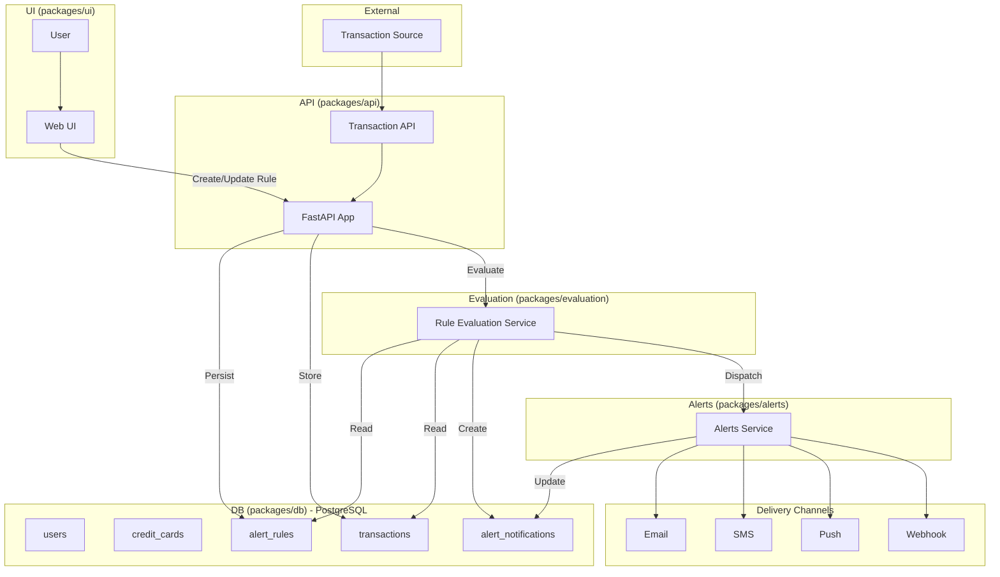

# Spending Transaction Monitor

An **AI-driven application** that enables users to define **natural language alert rules** for their credit card transactions. The system provides rule-based fraud detection and location-based security monitoring, ingesting real-time data, evaluating transactions against user-defined rules, applying AI/ML analysis for anomaly detection, and sending alerts through preferred channels such as email or SMS.

## 🚀 Overview

The Spending Transaction Monitor acts as an intelligent intermediary between credit card transaction streams and customers.  

- Users define alert rules in **plain natural language** (e.g., *“Alert me if I spend more than $200 at restaurants this month”*).  
- The system ingests transaction events in real-time.  
- An **NLP engine** converts rules into structured criteria.  
- A **rule engine** evaluates each new transaction against rules, user data, and behavioral patterns.  
- Alerts are triggered and delivered via email, or SMS notification.  

This project demonstrates how to combine **OpenShift AI, and modern ML frameworks** to deliver real-time, user-centric financial monitoring.


## 🏗 Architecture

The solution is deployed on **OpenShift** and integrates multiple components:

- **Transaction Ingestion Service**: Securely receives credit card transaction data in real-time and stores that in the database.  
- **Transaction Data Store**: Stores both historical and streaming data (PostgreSQL).  
- **Customer UI**: React frontend for defining and managing alerts with location-based fraud detection.  
- **NLP Module (LlamaStack + LangGraph Agent)**: Parses natural language into machine-readable rules.  
- **Rules Engine / Alerting Service**: Evaluates transactions against user rules, behavioral patterns, and location-based risk assessment.  
- **AI/ML Behavioral Analysis**: Detects anomalies, spending spikes, recurring patterns, and location-based fraud indicators.  
- **Location-based Security**: Captures user GPS coordinates for enhanced security monitoring and fraud detection.  
- **Notification Service**: Sends alerts via email, SMS, push notifications, or webhooks.  

## Key Features

- Users create alert rules (amount, merchant, category, timeframe, location; notification methods: email/SMS/push/webhook).
- Location-based fraud detection captures user GPS coordinates for enhanced security monitoring.
- Incoming transactions are stored and evaluated against active rules, including location-based risk assessment.
- Triggered rules produce alert notifications which are delivered via configured channels.



## ✨ Features

- **Natural Language Rule Creation**  
  Define alerts in everyday language (e.g., *“Notify me if I spend 3x more than usual on dining”*).

- **Flexible Rule Management**  
  Add, delete, or pause rules at any time through the UI.

- **Behavioral AI Analysis**  
  Detect anomalies such as unusual merchant categories, high-frequency spending, or out-of-pattern locations.

- **Location-Aware Alerts**  
  Compare transaction location with user’s home, last transaction, or last mobile location.

- **Historical Spend Analysis**  
  Evaluate transactions against aggregated historical trends (e.g., *monthly average dining spend*).

- **Multi-Channel Notifications**  
  Deliver alerts via **Email**, or **SMS**.

## 📦 Technology Stack

- **Frontend**: React  
- **Backend**: FastAPI, Python
- **Databases**: PostgreSQL (transactions, rules, users)  
- **AI/ML**: LlamaStack, LangGraph, TensorFlow/PyTorch, RHOAI  
- **Deployment**: OpenShift, Kubernetes-native microservices  
- **Notifications**: Email, SMS

## 📊 Example Alert Rules

| Category              | Example Trigger                                                                 |
|-----------------------|---------------------------------------------------------------------------------|
| **Spending Pattern**  | “Your dining expense of $98 is 45% higher than your average of $67 over 30 days.”|
| **Recurring Payment** | “Netflix charged $18.99 this month vs. your usual $15.49 — a 22% increase.”      |
| **Location-Based**    | “Transaction in Boston detected. Your last known location was Los Angeles.”      |
| **Merchant-Based**    | “Uber ride was $47.89, up from your last 5 ride average of $28.40.”              |

## 📂 Repository Structure

```
spending-transaction-monitor/
├── packages/
│   ├── api/
│   ├── db/
│   ├── ui/
│   ├── ingestion-service/
│   └── configs/
├── docs/
├── deploy/
├── .env.example
├── turbo.json
├── Makefile
├── pnpm-workspace.yaml
├── package.json
└── README.md
```

## ⚙️ Getting Started

### Prerequisites

- OpenShift cluster with **RHOAI**
- PostgreSQL instance  
- Python 3.11+  
- Node.js 18+  

### Setup

```bash
# Clone the repo
git clone https://github.com/rh-ai-quickstart/spending-transaction-monitor.git
cd spending-transaction-monitor
```

## 🐳 Container Deployment (Recommended)

### 🚀 Quick Start with Podman Compose

**Start with pre-built images:**

```bash
make run-local
```

**Build and run from source:**

```bash
make build-run-local
```

**Container URLs:**

- Frontend: http://localhost:3000
- API: http://localhost:3000/api/* (proxied)
- API Docs: http://localhost:8000/docs
- SMTP Web UI: http://localhost:3002
- Database: localhost:5432

**Container Management:**

```bash
make run-local      # Start with registry images
make build-local    # Build images from source
make build-run-local # Build and start
make stop-local     # Stop all services
make logs-local     # View service logs
make reset-local    # Reset with fresh data
```

**Setting Up Data:**

After starting services, set up the database and Keycloak:

```bash
pnpm setup:data       # Complete setup: Start DB + migrations + seed all data
pnpm seed:all         # Just seed data (DB + Keycloak) - migrations already run
pnpm seed:db          # Seed only database
pnpm seed:keycloak    # Setup only Keycloak realm

# Or using make
make setup-data       # Complete data setup: Start DB + migrations + all data
make seed-all         # Seed both DB and Keycloak
```

**Note:** `pnpm setup:data` now automatically starts the database, so you don't need to run `pnpm db:start` separately.

📖 **See [SEEDING.md](SEEDING.md) for complete seeding documentation**

### 🔐 Authentication Modes

The application supports two authentication modes:

#### **Production Mode (Default) - Keycloak OAuth2/OIDC**

By default, the application uses **Keycloak** for secure authentication:

- **Automatic Setup**: Keycloak realm and test users are automatically created on startup
- **OAuth2/OIDC Flow**: Implements OpenID Connect with PKCE for secure authentication
- **Automatic Token Refresh**: Tokens are automatically refreshed before expiration
- **Test Users**: 
  - `testuser` / `password` (Regular user)
  - `adminuser` / `password` (Admin user)

**Access Points:**
- Frontend: http://localhost:3000 (redirects to Keycloak login)
- Keycloak Admin: http://localhost:8080 (admin / admin)
- API Docs: http://localhost:8000/docs

#### **Development Mode - Auth Bypass**

For local development, you can bypass authentication:

```bash
# Set environment variables for bypass mode
BYPASS_AUTH=true VITE_BYPASS_AUTH=true VITE_ENVIRONMENT=development make build-run-local
```

In bypass mode:
- ✅ No login required - automatic authentication as dev user
- ✅ Yellow "DEV MODE - Authentication Bypassed" banner visible
- ✅ Faster development iteration
- ⚠️ **NOT for production use**

**Switching Between Modes:**

```bash
# Production mode (Keycloak authentication)
make build-run-local

# Development mode (auth bypass)
BYPASS_AUTH=true VITE_BYPASS_AUTH=true VITE_ENVIRONMENT=development make build-run-local
```

**Environment Variables:**

| Variable | Values | Description |
|----------|--------|-------------|
| `BYPASS_AUTH` | `true`/`false` | Backend auth bypass |
| `VITE_BYPASS_AUTH` | `true`/`false` | Frontend auth bypass |
| `VITE_ENVIRONMENT` | `development`/`staging`/`production` | Environment mode |
| `KEYCLOAK_URL` | URL | Keycloak server URL (default: `http://localhost:8080`) |

## 💻 Local Development (pnpm)

For local development without containers, use these pnpm commands:

### Development Mode (Auth Bypass)

```bash
# Install dependencies
pnpm setup

# Start in development mode (auth bypassed)
pnpm start:dev

# Or start individual services
pnpm backend:setup     # Setup database
pnpm backend:start     # Start API (port 8002, auth bypass)
pnpm --filter @*/ui dev # Start UI (port 3000)
```

### Production Mode (Keycloak)

```bash
# Start with Keycloak authentication
pnpm start:prod

# Access points:
# - Frontend: http://localhost:3000
# - API: http://localhost:8002
# - Keycloak: http://localhost:8080
```

### Container Development

```bash
# With Keycloak authentication (default)
pnpm dev:containers:auth

# With auth bypass (no login required) - fastest iteration
pnpm dev:containers:noauth

# Standard container startup (without rebuild)
pnpm dev:containers
```

**Or using Make directly:**

```bash
# Build and run with Keycloak authentication (default)
make build-run-local

# Build and run with auth bypass (no authentication)
make build-run-local-noauth

# Run without rebuilding
make run-local
```

### Utility Commands

```bash
# Database management
pnpm db:start          # Start PostgreSQL container
pnpm db:stop           # Stop PostgreSQL container
pnpm db:upgrade        # Run migrations
pnpm db:seed           # Load sample data
pnpm db:verify         # Verify database connection

# Authentication
pnpm auth:start        # Start Keycloak container
pnpm auth:stop         # Stop Keycloak container
pnpm auth:setup-keycloak                # Setup Keycloak realm/client
pnpm auth:setup-keycloak-with-users     # Setup Keycloak with DB users

# Code quality
pnpm lint              # Run all linters
pnpm lint:fix          # Auto-fix linting issues
pnpm format            # Format code
pnpm test              # Run tests
pnpm type-check        # Run TypeScript checks
```

## 🧪 Testing Alert Rules

After starting the application with `make run-local`, you can test alert rules interactively:

### **Interactive Alert Rule Testing**

**List available sample alert rules:**

```bash
make list-alert-samples
```

Shows all available test scenarios with their descriptions, such as:

- "Alert when spending more than $500 in one transaction"
- "Alert me if my dining expense exceeds the average of the last 30 days by more than 40%"
- "Alert me if a transaction happens outside my home state"

**Interactive testing menu:**

```bash
make test-alert-rules
```

This command provides:

- 📋 **Alert Rule Menu** showing alert rule descriptions
- 📊 **Data preview** with realistic transaction data adjusted to current time
- 🔍 **User context** showing the test user profile and transaction history
- ✅ **Confirmation prompt** before running the actual test

## 📧 Validating the Alert Notification

After confirming a rule test:

1. The system sends a test notification via the configured **test SMTP server**.
2. To verify:
   - Open the SMTP server Web UI:  
     👉 [http://localhost:3002](http://localhost:3002)
   - Check the inbox for the test email.
   - Open the email to confirm:
     - The **rule name/description** is included.
     - The **transaction details** that triggered the rule are shown.

### **Example Workflow**

1. **Start the application:**

   ```bash
   make run-local
   ```

2. **Browse available test scenarios:**

   ```bash
   make list-alert-samples
   ```

3. **Run interactive testing:**

   ```bash
   make test-alert-rules
   ```

   - Select an alert rule by number (1-16)
   - Review the data preview showing exactly what will be tested
   - Confirm to proceed with the test
   - Watch the complete validation and creation process

### **What the Test Does**

The test process:

1. **Seeds database** with realistic user and transaction data
2. **Validates the alert rule** using the NLP validation API
3. **Creates the alert rule** if validation passes
4. **Shows step-by-step results** including SQL queries and processing steps

**Note:** Make sure the API server is running (`make run-local`) before testing alert rules.

## ☁️ OpenShift Deployment

### 🚀 Quick Deploy

The fastest way to deploy to OpenShift:

```bash
# 1. Configure environment variables
cp env.example .env.production
# Edit .env.production with your settings

# 2. Login to OpenShift
oc login --token=<your-token> --server=<your-server>

# 3. Deploy with Keycloak authentication (recommended)
make deploy MODE=keycloak NAMESPACE=my-app

# Or deploy without auth for development/testing
make deploy MODE=noauth NAMESPACE=dev-test
```

### 📋 Prerequisites

**Required Tools:**
- OpenShift CLI (`oc`) - v4.10 or later
- Helm - v3.8 or later
- Podman - v4.0 or later (for building images)
- Make - For using Makefile commands

**Access Requirements:**
- OpenShift cluster with project admin permissions
- Container registry access (default: quay.io)
- Sufficient cluster resources (see resource requirements below)

**Configuration Files:**
- `.env.production` - OpenShift deployment variables (copy from `env.example`)
- `.env.development` - Local development variables

### 🎯 Deployment Modes

The application supports three deployment modes via the `MODE` parameter:

#### MODE=keycloak (Authenticated - Recommended)

For staging/production environments requiring authentication:

```bash
make deploy MODE=keycloak NAMESPACE=my-app
```

**Features:**
- ✅ Keycloak SSO authentication
- ✅ Multiple replicas (API: 2, UI: 2)
- ✅ Persistent database storage (50Gi)
- ✅ Automatic user sync from database to Keycloak
- ✅ Full resource allocation (2 CPU cores, 4Gi memory)

**Resource Requirements:**
- CPU: ~2000m (2 cores)
- Memory: ~4Gi
- Storage: 50Gi (database PVC)

#### MODE=noauth (Development/Testing)

For development and testing without authentication:

```bash
make deploy MODE=noauth NAMESPACE=dev-test
```

**Features:**
- ✅ Authentication bypassed
- ✅ Single replicas (API: 1, UI: 1)
- ✅ Ephemeral storage (no PVC)
- ✅ Reduced resources (600m CPU, 1.5Gi memory)
- ⚠️ Yellow banner shows "DEV MODE - Authentication Bypassed"
- ⚠️ **NOT for production**

#### MODE=dev (Reduced Resources)

For resource-constrained environments:

```bash
make deploy MODE=dev NAMESPACE=my-dev
```

**Features:**
- ✅ Keycloak authentication enabled
- ✅ Single replicas (API: 1, UI: 1)
- ✅ Reduced resources for testing
- ⚠️ Not for high-load production

### 🔧 Environment Configuration

Create your `.env.production` file:

```bash
cp env.example .env.production
```

**Required Variables:**

```bash
# Database Configuration
DATABASE_HOST=spending-monitor-database
DATABASE_PORT=5432
DATABASE_NAME=spending_monitor
DATABASE_USER=postgres
DATABASE_PASSWORD=<your-secure-password>

# Keycloak Configuration (for MODE=keycloak)
KEYCLOAK_URL=https://keycloak-<namespace>.apps.<cluster-domain>
KEYCLOAK_REALM=spending-monitor
KEYCLOAK_CLIENT_ID=spending-monitor-client
KEYCLOAK_CLIENT_SECRET=<your-client-secret>

# Notification Settings
SMTP_HOST=<your-smtp-host>
SMTP_PORT=587
SMTP_USER=<your-smtp-user>
SMTP_PASSWORD=<your-smtp-password>
SMTP_FROM=noreply@example.com

# Application Settings
ENVIRONMENT=production
API_LOG_LEVEL=info
```

### 📦 Step-by-Step Deployment

#### 1. Login and Create Project

```bash
# Login to OpenShift
oc login --token=<your-token> --server=<your-server>

# Create project/namespace
make create-project NAMESPACE=my-app
```

#### 2. Build and Push Images

```bash
# Login to container registry
make login

# Build all images
make build-all

# Push to registry
make push-all

# Or do all at once
make deploy-all MODE=keycloak NAMESPACE=my-app
```

#### 3. Deploy Application

```bash
# Deploy with Keycloak authentication
make deploy MODE=keycloak NAMESPACE=my-app

# The deployment will:
# 1. Create namespace (if needed)
# 2. Deploy database with persistent storage
# 3. Run migrations
# 4. Deploy Keycloak Operator CRs
# 5. Deploy API and UI services
# 6. Configure Nginx reverse proxy
# 7. Create OpenShift routes
# 8. Sync database users to Keycloak
```

#### 4. Access Application

```bash
# Get the route URL
oc get route spending-monitor-nginx-route -n my-app

# Or use make command
make status NAMESPACE=my-app
```

### 🔍 Monitoring & Management

**Check Status:**
```bash
make status NAMESPACE=my-app          # Show all resources
oc get pods -n my-app                 # List pods
oc get routes -n my-app               # Show routes
```

**View Logs:**
```bash
make logs-api NAMESPACE=my-app        # API logs
make logs-ui NAMESPACE=my-app         # UI logs
oc logs -f deployment/spending-monitor-api -n my-app
```

**Health Checks:**
- Nginx: `https://<route>/health`
- API: `https://<route>/api/health`
- UI: `https://<route>/`

**Update Deployment:**
```bash
# Rebuild and redeploy
make build-all
make push-all
make deploy MODE=keycloak NAMESPACE=my-app

# Or all at once
make deploy-all NAMESPACE=my-app
```

**Undeploy:**
```bash
make undeploy NAMESPACE=my-app        # Remove Helm release
make undeploy-all NAMESPACE=my-app    # Remove everything
```

### 📊 Scaling

**Scale via Helm:**
```bash
helm upgrade spending-monitor ./deploy/helm/spending-monitor \
  --namespace my-app \
  --set api.replicas=3 \
  --set ui.replicas=3
```

**Scale via oc:**
```bash
oc scale deployment/spending-monitor-api --replicas=3 -n my-app
oc scale deployment/spending-monitor-ui --replicas=3 -n my-app
```

### 🔐 Security Best Practices

1. **Use Strong Secrets:**
   - Generate strong passwords: `openssl rand -base64 32`
   - Never commit secrets to git
   - Use OpenShift Secrets for sensitive data

2. **Enable Authentication:**
   - Always use `MODE=keycloak` for non-development environments
   - Never use `MODE=noauth` in production

3. **Network Security:**
   - Routes are TLS-encrypted by default
   - Configure network policies as needed
   - Use service mesh for advanced security

4. **Database Security:**
   - Enable persistent storage for production
   - Configure backups via OpenShift
   - Restrict database access to internal cluster only

### 🛠️ Makefile Commands Reference

**Deployment:**
```bash
make deploy MODE=keycloak           # Deploy with Keycloak
make deploy MODE=noauth             # Deploy without auth
make deploy MODE=dev                # Deploy with reduced resources
make undeploy                       # Remove deployment
make deploy-all                     # Build, push, and deploy
```

**Building & Pushing:**
```bash
make build-all                      # Build all images
make push-all                       # Push to registry
make login                          # Login to registry
```

**Local Development:**
```bash
make build-run-local                # Build & run with Keycloak
make build-run-local MODE=noauth    # Build & run without auth
make run-local                      # Run with pre-built images
make stop-local                     # Stop all services
make reset-local                    # Reset with fresh data
```

**Management:**
```bash
make status                         # Show deployment status
make logs-api                       # View API logs
make logs-ui                        # View UI logs
make create-project                 # Create OpenShift project
```

### 🐛 Troubleshooting

**Pods not starting:**
```bash
# Check pod status
oc get pods -n my-app

# Check events
oc get events -n my-app --sort-by='.lastTimestamp'

# Describe problematic pod
oc describe pod <pod-name> -n my-app
```

**Database connection issues:**
```bash
# Check database pod
oc logs deployment/spending-monitor-database -n my-app

# Test connection from API pod
oc exec deployment/spending-monitor-api -n my-app -- \
  psql -h spending-monitor-database -U postgres -d spending_monitor -c "SELECT 1"
```

**Keycloak authentication issues:**
```bash
# Check Keycloak pods
oc get pods -l app=keycloak -n my-app

# Verify realm configuration
oc get keycloakrealm -n my-app
oc describe keycloakrealm spending-monitor-realm -n my-app
```

**Image pull issues:**
```bash
# Check if images exist in registry
podman search quay.io/rh-ai-quickstart/spending-monitor-api

# Verify registry credentials
oc get secrets -n my-app | grep pull
```

**Common Issues:**

| Issue | Solution |
|-------|----------|
| `ImagePullBackOff` | Verify image exists in registry and credentials are correct |
| `CrashLoopBackOff` | Check pod logs: `oc logs <pod-name>` |
| Database connection timeout | Ensure database pod is ready before API starts |
| Keycloak realm not created | Check Keycloak Operator is installed and running |
| Route not accessible | Verify route exists: `oc get routes` |

### 📚 Additional Resources

**Helm Chart:**
For advanced Helm configuration, see `deploy/helm/spending-monitor/values.yaml`

**Keycloak Setup:**
The Keycloak Operator is automatically configured. For manual setup, see `deploy/KEYCLOAK_OPERATOR.md`

**Environment Variables:**
See `env.example` for complete list of configuration options

## 🙌 Contributing

Contributions are welcome! Please fork the repo and submit a PR.  
See our [CONTRIBUTING.md](CONTRIBUTING.md) for guidelines.

## 📜 License

This project is licensed under the **Apache License 2.0**. See [LICENSE](LICENSE) for details.
