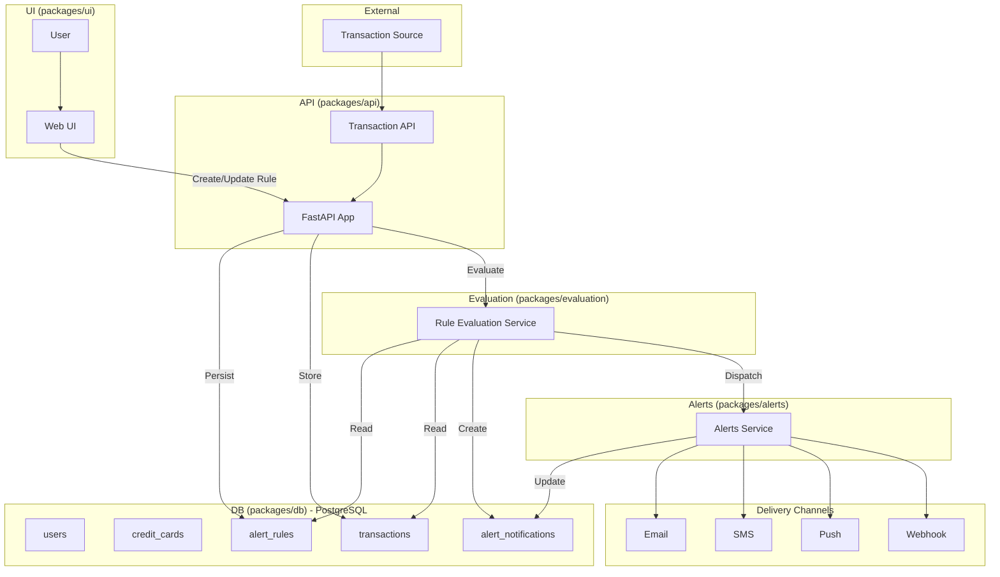

# Spending Transaction Monitor

An **AI-driven application** that enables users to define **natural language alert rules** for their credit card transactions. The system provides rule-based anomaly detection and location-based security monitoring, ingesting real-time data, evaluating transactions against user-defined rules, applying AI/ML analysis for anomaly detection, and sending alerts through preferred channels such as email or SMS.

## Table of Contents

- [Detailed Description](#detailed-description)
  - [Who is this for?](#who-is-this-for)
  - [The business case for AI-driven transaction monitoring](#the-business-case-for-ai-driven-transaction-monitoring)
  - [Example use cases](#example-use-cases)
  - [Sample data](#sample-data)
  - [What this quickstart provides](#what-this-quickstart-provides)
  - [What you'll build](#what-youll-build)
  - [Key technologies you'll learn](#key-technologies-youll-learn)
  - [Architecture diagrams](#architecture-diagrams)
  - [Project structure](#project-structure)
  - [Transaction monitoring implementation](#transaction-monitoring-implementation)
  - [Customizing for your use case](#customizing-for-your-use-case)
- [Requirements](#requirements)
  - [Minimum hardware requirements](#minimum-hardware-requirements)
  - [Minimum software requirements](#minimum-software-requirements)
  - [Required user permissions](#required-user-permissions)
- [Deploy](#deploy)
  - [Clone the repository](#clone-the-repository)
  - [Container Deployment (Recommended)](#container-deployment-recommended)
  - [Local Development (pnpm)](#local-development-pnpm)
  - [OpenShift Deployment](#openshift-deployment)
  - [Testing Alert Rules](#testing-alert-rules)
  - [Validating the Alert Notification](#validating-the-alert-notification)
  - [What you've accomplished](#what-youve-accomplished)
  - [Recommended next steps](#recommended-next-steps)
  - [Delete](#delete)
- [Technical Details](#technical-details)
  - [Performance & scaling](#performance--scaling)
  - [Security](#security)
  - [Going deeper: component documentation](#going-deeper-component-documentation)
- [Tags](#tags)

---

## Detailed Description

### Who is this for?

This quickstart guide is designed for:

- **Financial technology teams** implementing AI-driven transaction monitoring solutions
- **Solution architects** evaluating AI-powered anomaly detection platforms
- **Organizations** looking to provide personalized spending insights to customers

### The business case for AI-driven transaction monitoring

Many organizations are working to enhance customer experience through AI-powered financial monitoring. The Spending Transaction Monitor demonstrates how to combine modern AI/ML frameworks with real-time data processing to deliver personalized, user-centric financial alerts.

The key value propositions for implementing AI-driven transaction monitoring include:

- **Reduced anomaly exposure.** Real-time alerts help customers identify unauthorized transactions quickly, reducing financial losses and improving trust.
- **Enhanced customer experience.** Users define alerts in plain natural language, making the system accessible to non-technical users.
- **Personalized insights.** Behavioral AI analysis detects anomalies based on individual spending patterns, not just static thresholds.
- **Location-aware security.** GPS-based anomaly detection adds an additional layer of protection by comparing transaction locations with user whereabouts.
- **Multi-channel notifications.** Alerts are delivered via email or SMS, meeting customers where they prefer to receive information.

### Example use cases

Transaction monitoring scenarios suitable for this system include:

| Category              | Example Trigger                                                                   |
| --------------------- | --------------------------------------------------------------------------------- |
| **Spending Pattern**  | "Your dining expense of $98 is 45% higher than your average of $67 over 30 days." |
| **Recurring Payment** | "Netflix charged $18.99 this month vs. your usual $15.49 — a 22% increase."       |
| **Location-Based**    | "Transaction in Boston detected. Your last known location was Los Angeles."       |
| **Merchant-Based**    | "Uber ride was $47.89, up from your last 5 ride average of $28.40."               |

### Sample data

This project uses sample credit card transaction data from the [Credit Card Transactions Dataset](https://www.kaggle.com/datasets/priyamchoksi/credit-card-transactions-dataset) on Kaggle for demonstration and testing purposes.

### What this quickstart provides

This quickstart provides the framework, components, and knowledge to accelerate your journey to deploying AI-powered transaction monitoring. The system demonstrates how natural language processing, behavioral analysis, and location-based security can be combined into a cohesive alerting platform.

### What you'll build

**Time to complete:** 30-60 minutes (depending on deployment mode)

By the end of this quickstart, you will have:

- A fully functional AI-powered transaction monitoring system deployed locally or on OpenShift
- A working alert rule engine that parses natural language into machine-readable criteria
- Experience creating and testing alert rules via the React-based UI
- Understanding of how NLP, behavioral AI, and location-based security work together
- (Optional) Keycloak integration for production-grade authentication
- (Optional) OpenShift deployment for cloud-native scalability

### Key technologies you'll learn

Throughout this quickstart, you'll gain hands-on experience with modern AI and cloud-native technologies:

**AI & NLP Technologies:**

- **[LlamaStack](https://github.com/meta-llama/llama-stack)** - AI inference platform for natural language rule parsing
- **[LangGraph](https://langchain-ai.github.io/langgraph/)** - State machine framework for managing agent workflows
- **TensorFlow/PyTorch** - ML frameworks for behavioral anomaly detection
- **RHOAI (Red Hat OpenShift AI)** - Enterprise AI/ML platform

**Backend & Data:**

- **[FastAPI](https://fastapi.tiangolo.com/)** - High-performance Python API framework
- **[PostgreSQL](https://www.postgresql.org/)** - Relational database for transactions, rules, and users
- **[Alembic](https://alembic.sqlalchemy.org/)** - Database migration management

**Frontend:**

- **[React](https://react.dev/)** - Modern UI framework
- **[TypeScript](https://www.typescriptlang.org/)** - Type-safe JavaScript

**Authentication & Security:**

- **[Keycloak](https://www.keycloak.org/)** - OAuth2/OIDC authentication with PKCE

**Cloud-Native Infrastructure:**

- **[OpenShift](https://www.redhat.com/en/technologies/cloud-computing/openshift)/[Kubernetes](https://kubernetes.io/)** - Container orchestration and deployment platform
- **[Podman](https://podman.io/)** - Container runtime for local development
- **[Helm](https://helm.sh/)** - Kubernetes package manager

### Architecture diagrams

The solution is deployed on **OpenShift** and integrates multiple components:

- **Transaction Ingestion Service**: Securely receives credit card transaction data in real-time and stores it in the database.
- **Transaction Data Store**: Stores both historical and streaming data (PostgreSQL).
- **Customer UI**: React frontend for defining and managing alerts with location-based anomaly detection.
- **NLP Module (LlamaStack + LangGraph Agent)**: Parses natural language into machine-readable rules.
- **Rules Engine / Alerting Service**: Evaluates transactions against user rules, behavioral patterns, and location-based risk assessment.
- **AI/ML Behavioral Analysis**: Detects anomalies, spending spikes, recurring patterns, and location-based anomaly indicators.
- **Location-based Security**: Captures user GPS coordinates for enhanced security monitoring and anomaly detection.
- **Notification Service**: Sends alerts via email or SMS.



### Project structure

The repository is organized into the following key directories:

**Core Services:**

- **`packages/api/`** - FastAPI backend with NLP rule parsing and transaction evaluation
- **`packages/ui/`** - React frontend for alert management and transaction visualization
- **`packages/db/`** - PostgreSQL database schemas, migrations, and seeding utilities
- **`packages/evaluation/`** - Rule evaluation framework and metrics
- **`packages/ingestion-service/`** - Transaction ingestion pipeline

**Infrastructure & Configuration:**

- **`deploy/`** - Helm charts and OpenShift deployment configurations
- **`data/`** - Sample transaction and user data for testing
- **`scripts/`** - CI/CD and utility scripts

**Documentation:**

- **`docs/`** - Technical documentation and guides

```
spending-transaction-monitor/
├── packages/
│   ├── api/
│   ├── db/
│   ├── ui/
│   ├── ingestion-service/
│   └── configs/
├── docs/
├── deploy/
├── data/
├── scripts/
├── .env.example
├── turbo.json
├── Makefile
├── pnpm-workspace.yaml
├── package.json
└── README.md
```

### Transaction monitoring implementation

The transaction monitoring use case is implemented by combining the following components:

- **NLP Rule Parser** that converts natural language rules into structured SQL queries
- **Transaction Evaluation Engine** that processes incoming transactions against active rules
- **Behavioral Analysis Module** that detects anomalies based on spending patterns
- **Location-based Security** that compares transaction locations with user GPS data
- **Multi-channel Notification Service** that delivers alerts via email or SMS

**Key Features:**

- Users create alert rules (amount, merchant, category, timeframe, location; notification methods: email/SMS/push/webhook)
- Location-based anomaly detection captures user GPS coordinates for enhanced security monitoring
- Incoming transactions are stored and evaluated against active rules, including location-based risk assessment
- Triggered rules produce alert notifications which are delivered via configured channels

**Example Conversation: Creating an Alert Rule**

> **User:** "Alert me if I spend more than $500 in one transaction"
>
> **System:** ✓ Rule validated and created. You'll receive email notifications when any single transaction exceeds $500.

> **User:** "Alert me if my dining expense exceeds the average of the last 30 days by more than 40%"
>
> **System:** ✓ Rule validated. This rule compares each dining transaction against your 30-day dining average and alerts when spending is 40% above normal.

### Customizing for your use case

To adapt this quickstart for your specific transaction monitoring needs:

- Modify the NLP prompts in `packages/api/` to handle domain-specific rule types
- Add new transaction categories in `packages/db/` for your industry
- Create custom evaluation metrics in `packages/evaluation/`
- Build additional notification channels (Slack, webhook integrations)
- Integrate with your existing transaction data sources

---

## Requirements

### Minimum hardware requirements

- **CPU:** 4+ cores
- **Memory:** 8Gi+ (16Gi recommended for full stack with Keycloak)
- **Storage:** 20Gi

### Minimum software requirements

**Local Tools:**

- [Python 3.11+](https://www.python.org/downloads/)
- [Node.js 18+](https://nodejs.org/)
- [pnpm](https://pnpm.io/) - Fast, disk space efficient package manager
- [Podman](https://podman.io/getting-started/installation) or Docker - Container runtime
- [make](https://www.gnu.org/software/make/) - Build automation

**For OpenShift Deployment:**

- [oc CLI](https://docs.openshift.com/container-platform/latest/cli_reference/openshift_cli/getting-started-cli.html) - OpenShift command line tool
- [Helm](https://helm.sh/docs/intro/install/) - Kubernetes package manager
- OpenShift 4.x cluster with **RHOAI** (Red Hat OpenShift AI)

### Required user permissions

- Local admin permissions for container runtime (Podman/Docker)
- For OpenShift: Namespace admin permissions in the target project
- Access to container registry for pulling/pushing images

#### Cluster Admin Privileges

**IMPORTANT:** This quickstart utilizes some features that can only be used if the role you're using for installing the charts has `clusterAdmin`. This includes enabling and setting up the model registry. To learn more about the `clusterAdmin` privileges please see the [documentation](https://docs.redhat.com/en/documentation/red_hat_openshift_ai_self-managed/2.22/html/enabling_lab-tuning/installing-the-required-components-for-lab-tuning_enable-lab-tuning).

---

## Deploy

This section walks you through deploying and testing the Spending Transaction Monitor.

### Clone the repository

First, clone and navigate to the project directory:

```bash
# Clone the repository
git clone https://github.com/rh-ai-quickstart/spending-transaction-monitor.git
cd spending-transaction-monitor
```

**Expected outcome:**

- ✓ Repository cloned to local machine
- ✓ Working directory set to project root

### Container Deployment (Recommended)

**See Mac M Series [Installation Troubleshooting](./AppleSiliconPodmanSetup.md)**

#### Step 1: Start with Podman Compose

**Start with pre-built images:**

```bash
make run-local
```

**Build and run from source:**

```bash
make build-run-local
```

**Expected outcome:**

- ✓ All containers started successfully
- ✓ Services accessible at their respective URLs

**Container URLs:**

- Frontend: http://localhost:3000
- API: http://localhost:3000/api/\* (proxied)
- API Docs: http://localhost:8000/docs
- SMTP Web UI: http://localhost:3002
- Database: localhost:5432

#### Step 2: Set up data

After starting services, set up the database and Keycloak:

```bash
pnpm setup:data       # Complete setup: Start DB + migrations + seed all data
pnpm seed:all         # Just seed data (DB + Keycloak) - migrations already run
pnpm seed:db          # Seed only database
pnpm seed:keycloak    # Setup only Keycloak realm

# Or using make
make setup-data       # Complete data setup: Start DB + migrations + all data
```

**Note:** `pnpm setup:data` now automatically starts the database, so you don't need to run `pnpm db:start` separately.

📖 **See [DEVELOPER_GUIDE.md](docs/DEVELOPER_GUIDE.md) for complete seeding documentation**

**Expected outcome:**

- ✓ Database migrations applied
- ✓ Sample data loaded
- ✓ Keycloak realm configured (if using authentication)

#### Step 3: Choose authentication mode

The application supports two authentication modes:

**Production Mode (Default) - Keycloak OAuth2/OIDC**

By default, the application uses **Keycloak** for secure authentication:

- **Automatic Setup**: Keycloak realm and test users are automatically created on startup
- **OAuth2/OIDC Flow**: Implements OpenID Connect with PKCE for secure authentication
- **Automatic Token Refresh**: Tokens are automatically refreshed before expiration
- **Test Users** (for authentication testing, no sample data):
  - `testuser@example.com` / `password123` (Regular user)
  - `admin@example.com` / `admin123` (Admin user)
- **Sample Users** (with transaction data - use these to explore the app):
  - `monica.cohen@example.com` / `password123`
  - `barbara.taylor@example.com` / `password123`
  - Plus 48 more seeded users with realistic transaction histories

**Access Points:**

- Frontend: http://localhost:3000 (redirects to Keycloak login)
- Keycloak Admin: http://localhost:8080 (admin / admin)
- API Docs: http://localhost:8000/docs

**Development Mode - Auth Bypass**

For local development, you can bypass authentication:

```bash
# Set environment variables for bypass mode
BYPASS_AUTH=true VITE_BYPASS_AUTH=true VITE_ENVIRONMENT=development make build-run-local
```

In bypass mode:

- ✅ No login required - automatic authentication as dev user
- ✅ Yellow "DEV MODE - Authentication Bypassed" banner visible
- ✅ Faster development iteration
- ⚠️ **NOT for production use**

**Switching Between Modes:**

```bash
# Production mode (Keycloak authentication)
make build-run-local

# Development mode (auth bypass)
BYPASS_AUTH=true VITE_BYPASS_AUTH=true VITE_ENVIRONMENT=development make build-run-local
```

**Environment Variables:**

| Variable           | Values                               | Description                                            |
| ------------------ | ------------------------------------ | ------------------------------------------------------ |
| `BYPASS_AUTH`      | `true`/`false`                       | Backend auth bypass                                    |
| `VITE_BYPASS_AUTH` | `true`/`false`                       | Frontend auth bypass                                   |
| `VITE_ENVIRONMENT` | `development`/`staging`/`production` | Environment mode                                       |
| `KEYCLOAK_URL`     | URL                                  | Keycloak server URL (default: `http://localhost:8080`) |

#### Container Management Commands

```bash
make run-local      # Start with registry images
make build-local    # Build images from source
make build-run-local # Build and start
make stop-local     # Stop all services
make logs-local     # View service logs
make reset-local    # Reset with fresh data
```

### Local Development (pnpm)

For local development without containers, use these pnpm commands:

#### Development Mode (Auth Bypass)

```bash
# Install dependencies
pnpm setup

# Start in development mode (auth bypassed)
pnpm start:dev

# Or start individual services
pnpm backend:setup     # Setup database
pnpm backend:start     # Start API (port 8002, auth bypass)
pnpm --filter @*/ui dev # Start UI (port 3000)
```

#### Production Mode (Keycloak)

```bash
# Start with Keycloak authentication
pnpm start:prod

# Access points:
# - Frontend: http://localhost:3000
# - API: http://localhost:8002
# - Keycloak: http://localhost:8080
```

#### Container Development

```bash
# With Keycloak authentication (default)
pnpm dev:containers:auth

# With auth bypass (no login required) - fastest iteration
pnpm dev:containers:noauth

# Standard container startup (without rebuild)
pnpm dev:containers
```

**Or using Make directly:**

```bash
# Build and run with Keycloak authentication (default)
make build-run-local

# Build and run with auth bypass (no authentication)
BYPASS_AUTH=true VITE_BYPASS_AUTH=true VITE_ENVIRONMENT=development make build-run-local

# Run without rebuilding
make run-local
```

#### Utility Commands

```bash
# Database management
pnpm db:start          # Start PostgreSQL container
pnpm db:stop           # Stop PostgreSQL container
pnpm db:upgrade        # Run migrations
pnpm db:seed           # Load sample data
pnpm db:verify         # Verify database connection

# Authentication
pnpm auth:start        # Start Keycloak container
pnpm auth:stop         # Stop Keycloak container
pnpm auth:setup-keycloak                # Setup Keycloak realm/client
pnpm auth:setup-keycloak-with-users     # Setup Keycloak with DB users

# Code quality
pnpm lint              # Run all linters
pnpm lint:fix          # Auto-fix linting issues
pnpm format            # Format code
pnpm test              # Run tests
pnpm type-check        # Run TypeScript checks
```

### OpenShift Deployment

> **Note:** Some features in this quickstart require `clusterAdmin` privileges, particularly for enabling and setting up the model registry. See [Required user permissions](#required-user-permissions) for details.

#### Quick Deploy

**Using pre-built images**

```bash
make deploy
```

**Using Quay.io instead of the OpenShift internal registry:**

```bash
# 1) Authenticate to Quay (recommended: use a robot account token)
make REGISTRY_URL=quay.io QUAY_USERNAME=<quay-user-or-robot> QUAY_TOKEN=<token> login

# 2) Build + push to your Quay org + deploy
make REGISTRY_URL=quay.io REPOSITORY=<your-quay-org> IMAGE_TAG=<tag> build-deploy
```

**Using the OpenShift internal registry instead of Quay.io**

```bash
# Login and setup
# IMPORTANT: For OpenShift's internal registry, set REGISTRY_URL once and reuse it.
export REGISTRY_URL="$(oc get route default-route -n openshift-image-registry -o jsonpath='{.spec.host}')"
make login
make build-deploy
```

#### Step-by-step Deployment

```bash
# Login and setup
make login
make create-project

# Build and push images
make build-all
make push-all

# Deploy
make deploy
```

**Expected outcome:**

- ✓ Helm chart deployed successfully
- ✓ All pods running
- ✓ Routes created

#### Verify Deployment

```bash
make status           # Check deployment status
make logs-api         # View API logs
make logs-ui          # View UI logs
```

#### OpenShift Management

```bash
make deploy           # Deploy to OpenShift
make undeploy         # Remove deployment
make status           # Check deployment status
make logs-api         # View API logs
make logs-ui          # View UI logs
```

### Testing Alert Rules

After starting the application with `make run-local`, you can test alert rules interactively:

#### List available sample alert rules

```bash
make list-alert-samples
```

Shows all available test scenarios with their descriptions, such as:

- "Alert when spending more than $500 in one transaction"
- "Alert me if my dining expense exceeds the average of the last 30 days by more than 40%"
- "Alert me if a transaction happens outside my home state"

#### Interactive testing menu

```bash
make test-alert-rules
```

This command provides:

- 📋 **Alert Rule Menu** showing alert rule descriptions
- 📊 **Data preview** with realistic transaction data adjusted to current time
- 🔍 **User context** showing the test user profile and transaction history
- ✅ **Confirmation prompt** before running the actual test

#### Example Workflow

1. **Start the application:**

   ```bash
   make run-local
   ```

2. **Browse available test scenarios:**

   ```bash
   make list-alert-samples
   ```

3. **Run interactive testing:**

   ```bash
   make test-alert-rules
   ```

   - Select an alert rule by number (1-16)
   - Review the data preview showing exactly what will be tested
   - Confirm to proceed with the test
   - Watch the complete validation and creation process

#### What the Test Does

The test process:

1. **Seeds database** with realistic user and transaction data
2. **Validates the alert rule** using the NLP validation API
3. **Creates the alert rule** if validation passes
4. **Shows step-by-step results** including SQL queries and processing steps

**Note:** Make sure the API server is running (`make run-local`) before testing alert rules.

### Validating the Alert Notification

After confirming a rule test:

1. The system sends a test notification via the configured **test SMTP server**.
2. To verify:
   - Open the SMTP server Web UI:  
     👉 [http://localhost:3002](http://localhost:3002)
   - Check the inbox for the test email.
   - Open the email to confirm:
     - The **rule name/description** is included.
     - The **transaction details** that triggered the rule are shown.

**Expected outcome:**

- ✓ Email received in SMTP Web UI
- ✓ Alert contains rule description and transaction details
- ✓ Notification delivered within seconds of rule trigger

---

### What you've accomplished

By completing this quickstart, you have:

- ✓ Deployed a fully functional AI-powered transaction monitoring system
- ✓ Understood the core platform architecture and components
- ✓ Created and tested natural language alert rules
- ✓ Validated end-to-end alert notification delivery
- ✓ Learned how to customize the system for your own use cases

### Recommended next steps

**For Development Teams:**

- Review the [DEVELOPER_GUIDE.md](docs/DEVELOPER_GUIDE.md) for development setup and workflow
- Explore the API documentation at http://localhost:8000/docs
- Experiment with customizing alert rule prompts
- Set up additional notification channels

**For Organizations Planning Production Deployment:**

- Plan your transition from local to OpenShift deployment
- Integrate with your existing transaction data sources
- Establish evaluation criteria and quality metrics for your use case
- Review authentication configuration with Keycloak

**For Customizing to Your Use Case:**

- Modify NLP prompts to handle domain-specific rule types
- Add custom transaction categories for your industry
- Build integration with your ITSM or notification systems
- Develop use-case-specific evaluation metrics

### Delete

You can stop the deployed services by running:

```bash
# Stop local containers
make stop-local

# Remove OpenShift deployment
make undeploy
```

This will remove all deployed services, pods, and resources.

## Technical Details

### Performance & scaling

**OpenShift Management:**
The Spending Transaction Monitor is designed for scalability using standard Kubernetes and cloud-native patterns. All core components can be scaled using familiar Kubernetes techniques—horizontal pod autoscaling, replica sets, and resource limits.

**Component Scaling:**

- **API Service:** Scales horizontally with multiple FastAPI workers per pod and multiple pod replicas
- **Database:** PostgreSQL with connection pooling and read replicas for high-throughput scenarios
- **UI:** Static assets can be served via CDN for global distribution

**Performance Considerations:**

- Transaction evaluation is optimized for real-time processing
- NLP rule parsing leverages caching for frequently used patterns
- Notification delivery is asynchronous to avoid blocking transaction processing

### Security

Security considerations for production deployments:

- **Authentication:** Keycloak provides OAuth2/OIDC with PKCE for secure user authentication
- **API Security:** All endpoints protected with JWT token validation
- **Database:** Credentials managed via environment variables and Kubernetes secrets
- **Network:** Internal service communication isolated within Kubernetes namespace
- **Sensitive Data:** Transaction data encryption at rest and in transit

**For production deployments, consider:**

- Enabling TLS for all external endpoints
- Configuring network policies to restrict pod-to-pod communication
- Managing secrets through a vault solution
- Implementing audit logging for compliance requirements

### Going deeper: component documentation

Now that you have the system running, you can dive deeper into specific components:

**Guides:**

- [DEVELOPER_GUIDE.md](docs/DEVELOPER_GUIDE.md) - Development setup and workflow
- [KEYCLOAK_MANAGEMENT.md](docs/KEYCLOAK_MANAGEMENT.md) - Keycloak configuration and management
- [AppleSiliconPodmanSetup.md](AppleSiliconPodmanSetup.md) - Mac M-series troubleshooting

**Package Documentation:**

- [packages/api/README.md](packages/api/README.md) - API service documentation
- [packages/ui/README.md](packages/ui/README.md) - Frontend documentation
- [packages/db/README.md](packages/db/README.md) - Database schema and migrations

**Deployment:**

- [deploy/OPENSHIFT_DEPLOYMENT.md](deploy/OPENSHIFT_DEPLOYMENT.md) - OpenShift deployment guide
- [deploy/helm/](deploy/helm/) - Helm charts for Kubernetes deployment

---

## Tags

- **Title:** AI-Powered Transaction Monitoring with Natural Language Alert Rules
- **Description:** Framework for AI-driven credit card transaction monitoring with NLP rule parsing, behavioral analysis, and location-based anomaly detection.
- **Industry:** Financial Services, Banking
- **Product:** OpenShift AI
- **Use case:** Transaction monitoring, Anomaly detection, Personalized alerts
- **Contributor org:** Red Hat

---

## Contributing

Contributions are welcome! Please fork the repo and submit a PR.  
See our [CONTRIBUTING.md](CONTRIBUTING.md) for guidelines.

## License

This project is licensed under the **Apache License 2.0**.

---

**Thank you for using the Spending Transaction Monitor Quickstart!** We hope this guide helps you successfully deploy AI-driven transaction monitoring for your organization.
