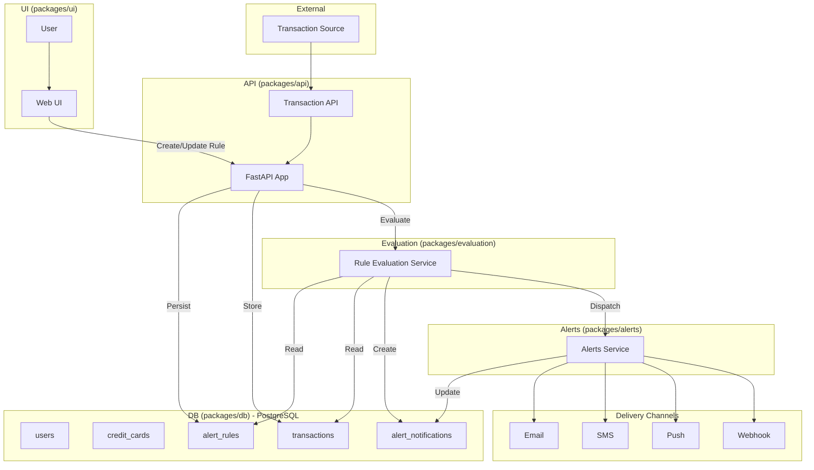

# Spending Transaction Monitor

An AI-driven financial monitoring platform that enables users to define natural language alert rules for credit card transactions. The system demonstrates how to implement intelligent, real-time transaction monitoring with behavioral analysis and location-based fraud detection on OpenShift.

## Overview

The Spending Transaction Monitor provides a comprehensive blueprint for building AI-powered financial monitoring systems. Key benefits include:

- **Simplified Alert Creation** - Users define rules in plain English instead of complex configuration
- **Proactive Fraud Detection** - Location-based security monitoring and behavioral anomaly detection
- **Real-Time Monitoring** - Continuous transaction evaluation against user-defined rules and behavioral patterns
- **Multi-Channel Notifications** - Flexible alert delivery via email and webhooks (SMS planned)
- **Behavioral Intelligence** - AI-driven analysis of spending patterns, anomalies, and recurring payment changes

The system acts as an intelligent intermediary between credit card transaction streams and customers, combining OpenShift AI and modern ML frameworks to deliver real-time, user-centric financial monitoring.

## Architecture

The platform consists of several core components deployed on **OpenShift**:

- **Customer UI**: React-based frontend for defining and managing alert rules with location-based fraud detection
- **API Service**: FastAPI backend with AI-powered transaction monitoring and alerting
- **Transaction Store**: PostgreSQL database with pgvector for historical and streaming transaction data
- **NLP Module**: LlamaStack + LangGraph agents for parsing natural language into machine-readable rules
- **Rules Engine**: Real-time transaction evaluation against user rules, behavioral patterns, and location-based risk assessment
- **AI/ML Behavioral Analysis**: Anomaly detection for spending spikes, unusual patterns, and location-based fraud indicators
- **Location Security**: GPS coordinate capture for enhanced security monitoring and fraud detection
- **Notification Service**: Multi-channel alert delivery (Email, Webhooks; SMS and Push planned)
- **Authentication**: Keycloak OAuth2/OIDC integration with development bypass mode

The system uses modern technologies including:
- FastAPI for high-performance async API operations
- React for responsive user interfaces
- LlamaStack + LangGraph for AI-powered rule generation
- PostgreSQL with pgvector for transaction storage and similarity search
- Keycloak for enterprise authentication
- OpenShift for containerized deployment



## Deployment Requirements

**Local Development Tools:**
- Python 3.11+, Node.js 18+, pnpm
- Podman/Docker, Helm, oc/kubectl CLI
- Git, Make, uv (Python package manager)

**Cluster Environment:**
- **Development Mode**: OpenShift/Kubernetes cluster with basic setup
- **Production Mode**: OpenShift with RHOAI (Red Hat OpenShift AI)

**Credentials:**
- OpenShift cluster access (for deployment)
- LLM API endpoint (OpenAI, Llama Stack, or compatible provider)
- Optional: SMTP server for email notifications

## Quick Setup

### Local Development (Recommended)

1. **Clone Repository**
```bash
git clone https://github.com/rh-ai-quickstart/spending-transaction-monitor.git
cd spending-transaction-monitor
```

2. **Install Dependencies**
```bash
pnpm install
```

3. **Start Complete Stack**
```bash
# Option 1: Pre-built containers with Keycloak authentication
make run-local

# Option 2: Build and run from source
make build-run-local

# Option 3: Development mode with auth bypass (fastest iteration)
BYPASS_AUTH=true VITE_BYPASS_AUTH=true VITE_ENVIRONMENT=development make build-run-local
```

4. **Initialize Data**
```bash
# Complete setup: migrations + seed all data
pnpm setup:data

# Or seed just database/Keycloak separately
pnpm seed:db
pnpm seed:keycloak
```

**Access Points:**
- Frontend: http://localhost:3000
- API: http://localhost:8000
- API Docs: http://localhost:8000/docs
- Keycloak: http://localhost:8080 (admin/admin)
- SMTP Test UI: http://localhost:3002
- Database: localhost:5432

### OpenShift Deployment

**Quick Deploy (Recommended):**
```bash
# Login to OpenShift
oc login --server=https://your-cluster:6443

# Create project and deploy
oc new-project spending-monitor
make deploy
```

**Manual Helm Deployment:**

For more control over deployment settings:

```bash
export CLUSTER_DOMAIN=$(oc get ingresses.config.openshift.io cluster -o jsonpath='{.spec.domain}')
export NAMESPACE=$(oc project -q)

helm install spending-monitor ./deploy/helm/spending-monitor \
  -f deploy/helm/spending-monitor/values-llamastack.yaml \
  --set secrets.POSTGRES_PASSWORD="YourSecurePassword" \
  --set secrets.API_KEY="YourAPIKey" \
  --set routes.sharedHost="spending-monitor-${NAMESPACE}.apps.${CLUSTER_DOMAIN}"
```

**Monitor Deployment:**
```bash
make status              # Check deployment status
watch oc get pods        # Watch pods come up
oc get routes            # View application routes
```

See [QUICKSTART_LLAMASTACK.md](deploy/helm/spending-monitor/QUICKSTART_LLAMASTACK.md) for detailed deployment instructions.

## Key Features

### Natural Language Rule Creation

Users define alerts in everyday language without needing to understand query syntax:

```
"Alert me if I spend more than $500 in one transaction"
"Notify me if my dining expense exceeds the average of the last 30 days by more than 40%"
"Alert me if a transaction happens outside my home state"
"Send an alert when I have more than 3 transactions per day at restaurants"
```

### AI-Powered Alert Processing

The system uses LangGraph agents to:
1. Parse natural language into structured criteria
2. Generate SQL queries for transaction evaluation
3. Validate rules against sample data
4. Check for duplicate rules using similarity embeddings
5. Continuously monitor transactions in the background
6. Trigger notifications when conditions are met

### Location-Based Fraud Detection

- Captures user GPS coordinates for enhanced security
- Compares transaction location with user's home, last transaction, or current mobile location
- Detects unusual geographic patterns and high-risk locations
- Provides context-aware security alerts

### Behavioral Analysis

The AI/ML engine detects:
- Unusual merchant categories compared to user history
- Spending spikes above normal patterns
- High-frequency transaction anomalies
- Recurring payment amount changes
- Out-of-pattern geographic locations

### Multi-Channel Notifications

Deliver alerts through configured channels:
- **Email** - HTML-formatted alerts with transaction details
- **Webhooks** - Integration with external systems
- **SMS** - Text message notifications (planned)
- **Push Notifications** - Mobile app notifications (planned)

## Example Alert Rules

| Category              | Example Trigger                                                                 |
|-----------------------|---------------------------------------------------------------------------------|
| **Spending Pattern**  | "Your dining expense of $98 is 45% higher than your average of $67 over 30 days."|
| **Recurring Payment** | "Netflix charged $18.99 this month vs. your usual $15.49 — a 22% increase."      |
| **Location-Based**    | "Transaction in Boston detected. Your last known location was Los Angeles."      |
| **Merchant-Based**    | "Uber ride was $47.89, up from your last 5 ride average of $28.40."              |
| **Threshold-Based**   | "Single transaction of $547 exceeds your $500 alert threshold."                  |

## Technology Stack

- **Frontend**: React, TypeScript, Vite
- **Backend**: FastAPI (Python 3.11+), async/await architecture
- **Database**: PostgreSQL with pgvector for embeddings
- **AI/ML**: LlamaStack, LangGraph agents, OpenAI-compatible LLMs
- **Authentication**: Keycloak OAuth2/OIDC with PKCE flow
- **Deployment**: OpenShift, Kubernetes, Helm charts
- **Notifications**: SMTP (email), webhooks (SMS planned)
- **Development**: Turborepo monorepo, pnpm workspaces

## Repository Structure

```
spending-transaction-monitor/
├── packages/
│   ├── api/                    # FastAPI backend with AI alert processing
│   ├── ui/                     # React frontend application
│   ├── db/                     # PostgreSQL database models and migrations
│   ├── auth/                   # Keycloak authentication configuration
│   ├── evaluation/             # Testing and evaluation frameworks
│   ├── ingestion-service/      # Transaction ingestion service
│   └── configs/                # Shared configuration files
├── deploy/
│   └── helm/                   # Helm charts for OpenShift deployment
│       ├── spending-monitor/   # Main application chart
│       └── keycloak/          # Keycloak deployment chart
├── scripts/                    # Utility scripts for testing and setup
├── docs/                       # Additional documentation
├── data/                       # Sample data and test fixtures
├── .env.development            # Development environment variables
├── podman-compose.yml          # Local container orchestration
├── nginx.conf                  # Reverse proxy configuration
├── Makefile                    # Build and deployment automation
├── turbo.json                  # Turborepo configuration
└── README.md
```

## Testing and Evaluation

### Interactive Alert Rule Testing

After starting the application, test alert rules interactively:

```bash
# List available test scenarios
make list-alert-samples

# Run interactive testing menu
make test-alert-rules
```

The test process:
1. Shows available alert rule scenarios with descriptions
2. Displays realistic transaction data adjusted to current time
3. Provides user context and transaction history preview
4. Validates the alert rule using the NLP validation API
5. Creates the alert rule if validation passes
6. Shows step-by-step results and SQL queries

### Validating Alert Notifications

After running a test:
1. The system sends notifications via the configured test SMTP server
2. Open the SMTP Web UI at http://localhost:3002
3. Check the inbox for the test email
4. Verify the email contains:
   - Rule name/description
   - Transaction details that triggered the rule
   - Behavioral analysis context

### Development Modes

**Production Mode (Default)** - Full Keycloak authentication:
```bash
make build-run-local
# Access: http://localhost:3000 (redirects to Keycloak login)
# Users: testuser/password, adminuser/password
```

**Development Mode** - Auth bypass for faster iteration:
```bash
BYPASS_AUTH=true VITE_BYPASS_AUTH=true VITE_ENVIRONMENT=development make build-run-local
# Access: http://localhost:3000 (automatic login, yellow dev banner)
# ⚠️ NOT for production use
```

## Container Management

```bash
make run-local           # Start with registry images
make build-local         # Build images from source
make build-run-local     # Build and start
make stop-local          # Stop all services
make logs-local          # View service logs
make reset-local         # Reset with fresh data
```

## Database Management

```bash
pnpm db:start            # Start PostgreSQL container
pnpm db:stop             # Stop PostgreSQL container
pnpm db:upgrade          # Run migrations
pnpm db:seed             # Load sample data
pnpm db:verify           # Verify database connection
```

## Authentication Management

```bash
pnpm auth:start                        # Start Keycloak container
pnpm auth:stop                         # Stop Keycloak container
pnpm auth:setup-keycloak               # Setup Keycloak realm/client
pnpm auth:setup-keycloak-with-users    # Setup Keycloak with DB users
```

## OpenShift Deployment Commands

```bash
make full-deploy         # Complete deployment workflow
make login               # Login to OpenShift cluster
make create-project      # Create new project/namespace
make build-all           # Build all container images
make push-all            # Push images to registry
make deploy              # Deploy to OpenShift
make undeploy            # Remove deployment
make status              # Check deployment status
make logs-api            # View API logs
make logs-ui             # View UI logs
```

## Customization

To adapt for other financial monitoring use cases:

**Alert Rules**:
- Modify natural language processing prompts in `packages/api/src/services/alerts/agents/`
- Customize rule validation logic in `validate_rule_graph.py`
- Add new alert conditions in `generate_alert_graph.py`

**Behavioral Analysis**:
- Extend transaction analysis in `packages/api/src/services/transaction_service.py`
- Add custom anomaly detection algorithms
- Integrate additional ML models for fraud detection

**Notification Channels**:
- Implement new delivery methods in `packages/api/src/services/notification_service.py`
- Extend webhook integrations for external systems
- Add SMS providers (Twilio, AWS SNS, etc.) or push notification services

**Data Sources**:
- Extend transaction ingestion in `packages/ingestion-service/`
- Add new data connectors for different transaction sources
- Customize transaction normalization and categorization

The modular architecture allows most customizations through configuration updates without code changes.

## Documentation

- [API Documentation](packages/api/README.md) - FastAPI backend setup and endpoints
- [UI Documentation](packages/ui/README.md) - React frontend development
- [Database Documentation](packages/db/README.md) - Schema and migrations
- [OpenShift Deployment](deploy/OPENSHIFT_DEPLOYMENT.md) - Production deployment guide
- [LlamaStack Quickstart](deploy/helm/spending-monitor/QUICKSTART_LLAMASTACK.md) - Deploy with LlamaStack
- [Developer Guide](docs/DEVELOPER_GUIDE.md) - Development best practices
- [Location Fraud Detection](docs/location/README.md) - Location-based security
- [Keycloak Management](docs/KEYCLOAK_MANAGEMENT.md) - Authentication configuration
- [Seeding Guide](SEEDING.md) - Database seeding and test data

## Troubleshooting

### Database Connection Issues
```bash
# Check PostgreSQL is running
podman ps | grep postgres

# Restart database
make stop-local && make run-local

# Verify connection
pnpm db:verify
```

### Authentication Issues
```bash
# Development: Bypass authentication
BYPASS_AUTH=true pnpm backend:start

# Production: Check Keycloak
curl http://localhost:8080/realms/spending-monitor/.well-known/openid-configuration
```

### Alert Rule Creation Failures
- Verify LLM API credentials in `.env.development`
- Check `API_KEY` and `LLM_PROVIDER` settings
- Review API logs for detailed error messages
- Ensure natural language input is clear and specific

### Port Conflicts
- Frontend (3000): Change in `nginx.conf`
- API (8000): Set `API_PORT` environment variable
- PostgreSQL (5432): Modify `podman-compose.yml`
- Keycloak (8080): Configure `KEYCLOAK_URL`

## Contributing

Contributions are welcome! Please fork the repo and submit a PR.
See [CONTRIBUTING.md](CONTRIBUTING.md) for guidelines.

## License

This project is licensed under the **Apache License 2.0**. See [LICENSE](LICENSE) for details.

## Support

For issues and questions:
- GitHub Issues: https://github.com/rh-ai-quickstart/spending-transaction-monitor/issues
- Check logs: `make logs-local`
- Review documentation in the `docs/` directory
- Join our community discussions
